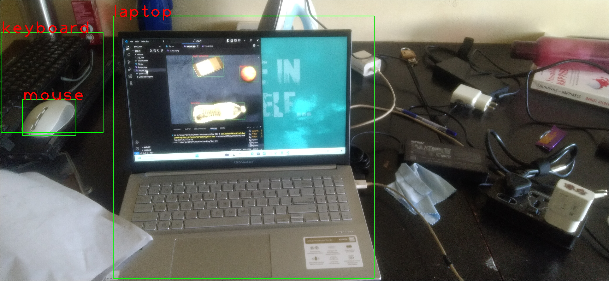

# Object Detection using YOLOv3

This project demonstrates how to perform object detection on an image using a pre-trained YOLOv3 model. It utilizes OpenCV's `cv2.dnn` module to load the YOLO model and detect objects in a given image.

## Requirements

- Python 3.x
- OpenCV (`cv2`)
- NumPy

To install the necessary dependencies, run:

pip install opencv-python numpy

## Files Required

1. **yolov3.weights**: Pre-trained YOLOv3 weights. You can download it from the following link:
   - [Download YOLOv3 Weights](https://github.com/patrick013/Object-Detection---Yolov3/blob/master/model/yolov3.weights)

2. **yolov3.cfg**: Configuration file for YOLOv3. You can find it in the [YOLO repository](https://github.com/pjreddie/darknet/blob/master/cfg/yolov3.cfg).

3. **coco.names**: A file containing the names of the classes YOLOv3 can detect. You can get it from [this link](https://github.com/pjreddie/darknet/blob/master/data/coco.names).

## How to Run

1. Place the following files in the same directory as the Python script:
   - yolov3.weights
   - yolov3.cfg
   - coco.names
   - image04.jpg (or any other image you want to test)

2. Run the Python script:

python object_detection.py

3. The script will read the image, perform object detection, and output an image with detected objects highlighted.

4. The output image will be saved as `output.jpg` in the same directory.

## How It Works

- The script first loads the YOLO model using the weights and configuration file.
- It then reads the input image and processes it to create a blob using `cv2.dnn.blobFromImage`.
- The blob is passed through the network to detect objects.
- Detected objects are filtered based on confidence scores (only objects with a confidence greater than 0.5 are considered).
- Bounding boxes are drawn around the detected objects, and class labels are added.
- The final output is saved as `output.jpg`.

## Output

The output will be an image with bounding boxes around detected objects and class labels displayed. For example:

